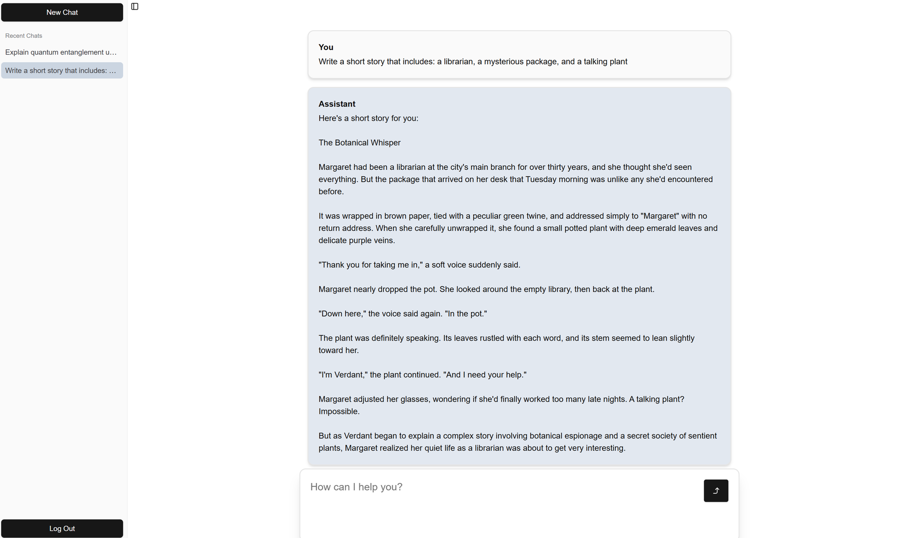
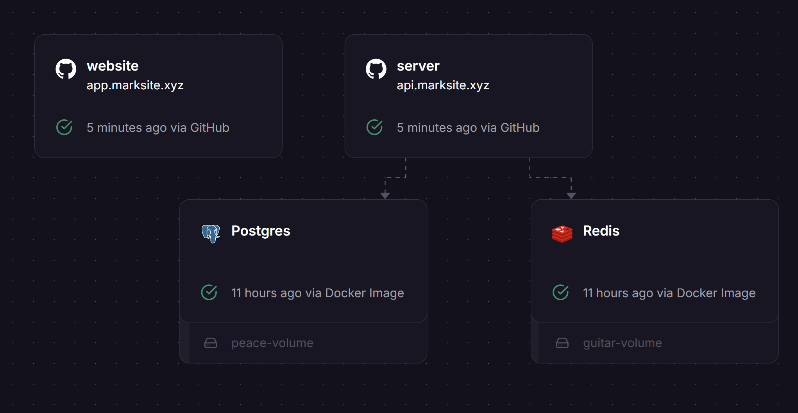
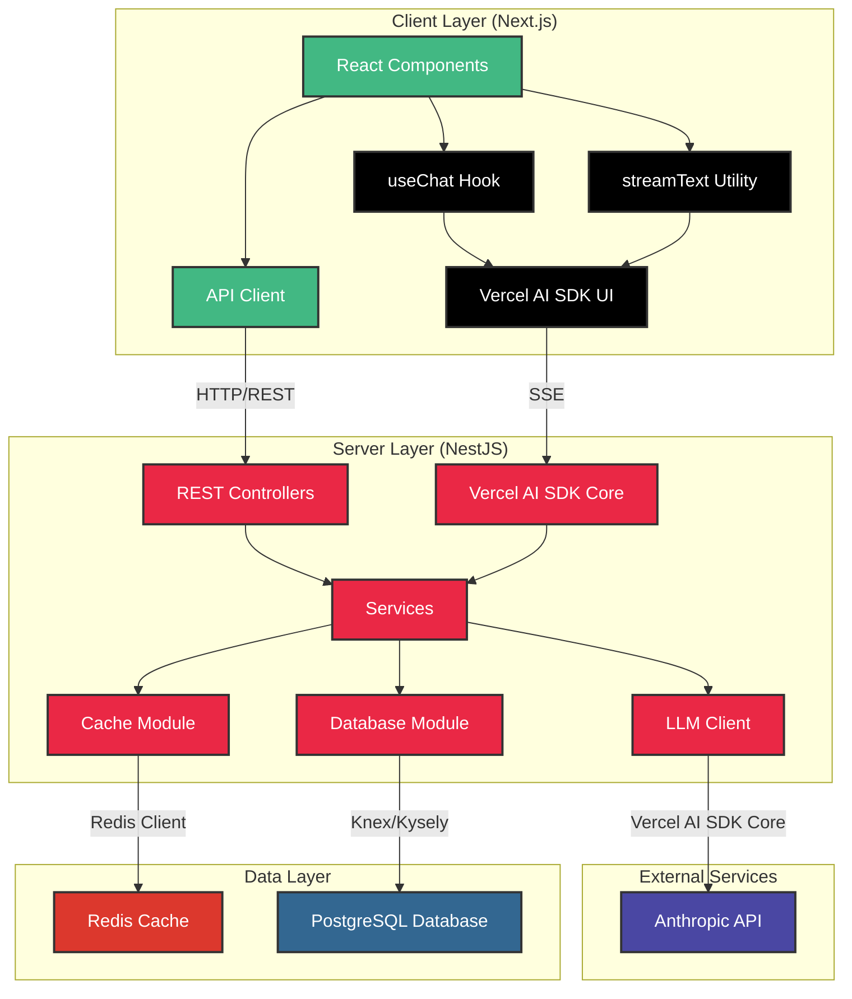

# Chatbot App - B Capital Exercise

Live app: https://app.marksite.xyz/

Sample Login - *Username:* `john`, *Password:* `123456`

&nbsp;


## Prerequisites
Ensure you have the following installed:

- Docker
- pnpm v9.x
- Node.js v22.13.0 (via nvm)

## Tech Stack

- TypeScript - For type-safe development
- Next.js - Modern frontend React framework
- Nest.js - Node.js framework for scalable backend
- PostgreSQL - Relational database
- Redis - In-memory store for caching
- TailwindCSS - Styling
- Kysely - Type-safe SQL query builder for TypeScript
- Anthropic - LLM API integration
- Vercel AI SDK - Wrapper for AI chat functionalities

## Local Development Setup

#### Server setup

1. Go to server directory
    ```
    cd server
    ```

1. Set correct Nodejs version 
    ```
    nvm use
    ```

1. Configure your environment
    ```
    cp .env.example .env.development
    ```
    Important note: Add your `ANTHROPIC_API_KEY`

1.  Setup and start PostgreSQL db and Redis cache 
    ```
    docker-compose up
    ```

1.  Install dependencies 
    ```
    pnpm install
    ```

1.  Run database migrations
    ```
    pnpm db:migrate:dev
    ```

1.  Start the server locally
    ```
    pnpm dev
    ```

#### Website setup

1.  Go to website directory
    ```
    cd website
    ```

1. Configure your environment
    ```
    cp .env.example .env.local
    ```
    *note: no other changes needed*

1.  Install dependencies
    ```
    pnpm install
    ```

1.  Run website locally
    ```
    pnpm dev
    ```

## Local Links

1. App: http://localhost:3000
1. Swagger API Docs: http://localhost:4000/api

## Deployment

The app is hosted on Railway



- Commits pushed to `production` branch will deploy to Railway automatically

## Architecture Diagram



## Folder Structure

#### Server

```
src/                    # NestJS app
├── cache/              # Caching implementation
├── config/             # App configs
├── database/           # DB configs & services
├── llm/                # LLM wrappers
├── migrations/         # DB migrations
├── modules/            # Feature modules
│   ├── auth/
│   │   ├── dto/                    # data transfer objects
│   │   ├── auth.controller.ts     
│   │   ├── auth.guard.ts           # Session auth
│   │   ├── auth.module.ts
│   │   ├── auth.service.ts
│   │   └── auth.type.ts
│   ├── chat/                       # Chat CRUD
│   │   ├── chat.model.ts
│   │   └── chat.repository.ts
│   ├── message/                    # Message CRUD
│   ├── stream/                     # SSE stream
│   └── user/                       # User CRUD
├── scripts             # Migration scripts
├── types               
├── app.controller.ts
├── app.module.ts
├── app.service.ts
└── main.ts             # Entry point
```

#### Client

```
website/            
├── api/                # API integration (not Nextjs API) 
├── app/                # App router
│   ├── chat/               # Chat route
│   │   └── [id]/           # Chat Id
│   │       └── page.tsx    
│   ├── login/              # Login route
│   │   └── page.tsx        
│   ├── sign-up/            # Sign up route
│   │   └── page.tsx
│   └── page.tsx
├── components/
│   └── ui/             # Shadcn UI components
├── constants/
├── hooks/              # Custom hooks
│   ├── auth/
│   ├── chat/
│   └── message/
├── lib/
├── providers/
├── public/
├── store/
├── .env.example
└── middleware.ts      # Handles protected routes 
```

## Design And Usability

1. Text input UI uses Framer Motion for animations
1. Auto-scrolls to bottom of chat window when new messages are received (if user is near the bottom of the window)
1. "Enter" shortcut to submit prompt

## Code Quality

1. The frontend uses Next.js app router, components are organized at route-level, APIs are encapsulated into custom hooks.

1. The backend is built with Nest.js, providing a structured MVC architecture with built-in decorators, guards, interceptors, and pipes, for a clean and maintainable codebase.


## Security

1. Secure session management via cookies
1. Server-side data validation using DTOs and class-validator
1. Protected API routes with NestJS guards
1. Configured CORS policy for API endpoints
1. Client-side route protection using Next.js middleware

## Future considerations

Planned but not implemented due to time constraints:
- Lint staged commits with Husky for enforced code style
- Automated testing via CI pipeline like Github actions
- Frontend Testing with Cypress/Jest
- Better OOP/SOLID patterns in backend, database models and interfaces could follow Dependency Inversion Principle